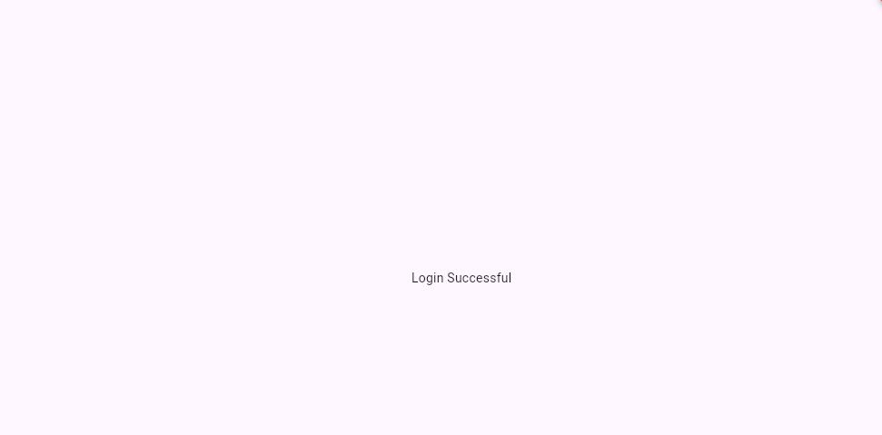
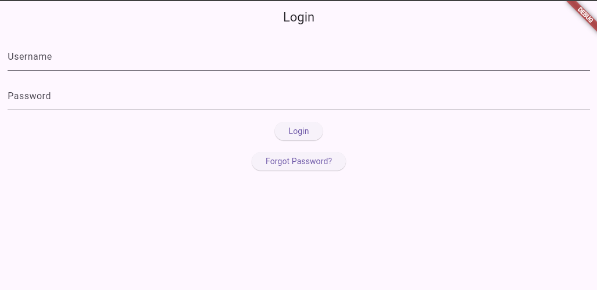
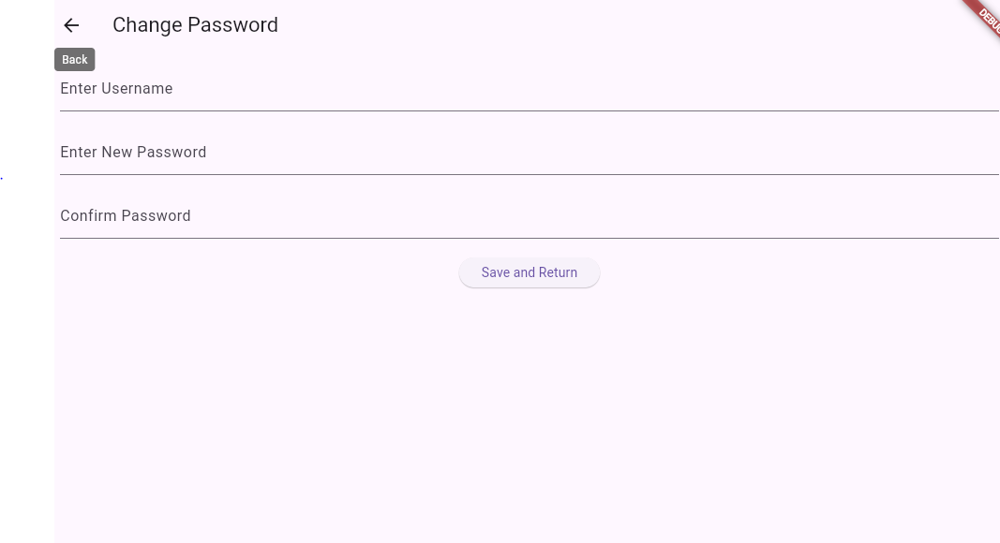

# Experiment 2: Login & Password Management

**Objective:** Implement user authentication with form validation and screen navigation.

## Description

A login system with credential validation and password reset functionality using shared state management.

## Key Features

- **Data Modeling:** `UserData` class with static variables for credentials
- **Input Handling:** `TextEditingController` to capture and clear user inputs
- **Authentication:** Credential matching and password validation
- **Navigation:** `Navigator.push` and `Navigator.pop` for screen transitions
- **Feedback:** `SnackBar` alerts for errors and success messages
- **Security:** `obscureText: true` for password fields

